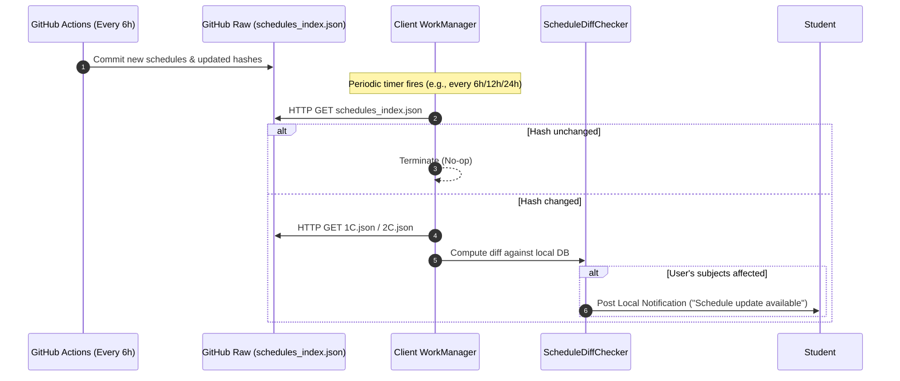
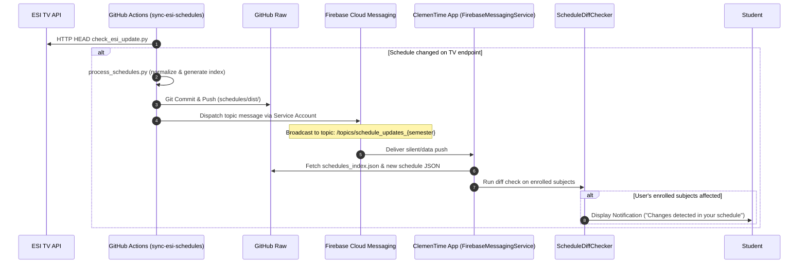

# Viability Study & Roadmap: Migrating ClemenTime to FCM Push-Based Schedule Updates

## 1. Executive Summary

ClemenTime currently uses a decentralized client-side polling mechanism (`worker/ScheduleUpdateWorker.kt` via Android WorkManager) to periodically query `schedules_index.json` hosted on GitHub (e.g., every 6, 12, or 24 hours). 

While polling avoids running dedicated server infrastructure, it introduces notable drawbacks:
- **Battery & radio wakeups**: Devices wake up periodically on battery to check for updates, even though university schedules change only a few times per semester.
- **Latency & reliability**: Changes are not received instantaneously; updates depend on the selected interval. Furthermore, OEM background restrictions (Doze mode, App Standby buckets, aggressive background killers on Xiaomi/Samsung) frequently delay or drop WorkManager periodic runs.
- **Wasted bandwidth**: Redundant HTTP requests against GitHub Raw from all active client devices.

This study explores the viability of transitioning ClemenTime from periodic background polling to **Firebase Cloud Messaging (FCM)** topic-based push notifications, coupled with an onboarding and settings experience that allows users to explicitly choose between:
1. **Online Services (Cloud-Enabled)**: Instant schedule downloads and push alerts when timetable/classroom changes occur.
2. **Fully Offline (Privacy-First)**: Zero network calls, no background push registrations, and purely local file/manual import.

### Viability Verdict: **Highly Viable & Cost-Effective**
Migrating to FCM does **not** require deploying or maintaining a 24/7 dedicated backend server. Because timetable changes are already discovered and committed by GitHub Actions (`.github/workflows/sync-esi-schedules.yml`), **GitHub Actions itself can act as the FCM push dispatcher** via the FCM HTTP v1 API or Firebase Admin SDK. FCM topic messaging eliminates the need to store device tokens in a database.

---

## 2. Architecture Comparison

### Current Architecture: Periodic WorkManager Polling



### Proposed Architecture: Event-Driven FCM Push via CI Dispatcher



---

## 3. Deep-Dive Viability Analysis

### 3.1. Infrastructure & Backend Feasibility: Zero Server Overhead

A common objection to adopting push notifications in indie or student projects is the burden of hosting and paying for a 24/7 backend server (Node.js, Go, VPS, etc.).

**ClemenTime does not need a dedicated backend:**
- **Trigger Source**: The CI workflow (`.github/workflows/sync-esi-schedules.yml`) already polls the official ESI TV endpoint (`https://esi.uclm.es/TV/hall/horarios.json`) every 6 hours and processes the data whenever changes occur.
- **Dispatcher**: Once the `Commit and Push` step succeeds in GitHub Actions, a small dispatch step (either a Python script using `firebase-admin` or a direct HTTP POST using curl to the FCM v1 REST API) can broadcast the push notification.
- **Topic Messaging (`/topics/schedules_1c`, `/topics/schedules_2c`)**:
  - The server (GitHub Actions) does not need to store, track, or manage individual device tokens.
  - Clients subscribe to the topic corresponding to their active semester (`schedule_updates_1c` or `schedule_updates_2c`) upon onboarding or semester selection.
  - Zero database or authentication backend is required.

### 3.2. Costs & Quotas

| Metric | Firebase / FCM Quota | ClemenTime Expected Usage | Cost |
| :--- | :--- | :--- | :--- |
| **FCM Pricing** | Free on Firebase Spark plan | Free | **$0.00 / month** |
| **Topic Messaging Volume** | Unlimited messages | ~1 to 5 messages per month (during term updates) | Free |
| **GitHub Actions Execution** | 2,000 free minutes/month for public/private repos | ~10-15 seconds per push step | Free |
| **GitHub Raw Bandwidth** | Unmetered for reasonable open-source traffic | Significantly reduced compared to periodic polling | Free |

### 3.3. Client Message Handling & Payload Constraints

- **FCM Payload Limit**: FCM data messages allow up to **4 KB** of key-value data. The full schedule JSON files (`1C.json` / `2C.json`) are ~150–300 KB, so the timetable **cannot** be embedded directly in the push payload.
- **Recommended Data Payload**:
  ```json
  {
    "semester": "1C",
    "hash": "4a7d18bc3...",
    "version": "2026.09.24",
    "timestamp": "1758723077"
  }
  ```
- **Execution Flow on Android**:
  1. `FirebaseMessagingService.onMessageReceived()` receives a data-only message (silent push).
  2. If the user has disabled online sync or is in "Fully Offline" mode, the message is ignored.
  3. If the incoming hash matches the locally stored `lastKnownHash`, execution terminates immediately.
  4. An expedited `OneTimeWorkRequest` is enqueued via WorkManager (adhering to Android 12+ foreground/background execution restrictions).
  5. The worker downloads the updated JSON, executes `ScheduleDiffChecker` against the student's enrolled subjects, and only triggers a high-priority user notification if the student's personal timetable is actually modified.

### 3.4. Google Play Services & FOSS / De-Googled Devices

ClemenTime currently does not link against Google Play Services. Adding FCM introduces proprietary Google libraries (`com.google.firebase:firebase-messaging`).

#### Considerations for De-Googled Devices (GrapheneOS, microG, LineageOS):
- Devices without Google Play Services or microG cannot establish FCM connections.
- If FCM is the *sole* update mechanism, de-Googled users would lose automatic update notifications.

#### Recommended Mitigation Strategies:
1. **Graceful Runtime Fallback**:
   - Check `GoogleApiAvailability.getInstance().isGooglePlayServicesAvailable(context)`:
     - If GMS is present and user chooses "Online Services": Use FCM topic push.
     - If GMS is absent: Seamlessly fall back to an optional, lightweight WorkManager periodic check (or manual check only).
2. **Product Flavors (Alternative)**:
   - `play`: Includes Google Services and Firebase FCM.
   - `foss`: Zero Google dependencies, pure offline or lightweight manual HTTP polling for F-Droid distributions.

### 3.5. Privacy & Data Protection

- **Student Anonymity**: Topic-based messaging preserves student privacy. The app subscribes to an aggregate topic (`schedule_updates_1c`). Google servers know a device is registered to that topic, but no student IDs, enrolled subjects, group selections, or personal schedules are transmitted to Google or any server.
- **Privacy Policy**: When FCM is enabled, Google's privacy policy applies for push delivery (device identifiers and IP addresses are processed by Google). The onboarding flow must disclose this transparently.

---

## 4. UX & Onboarding Redesign: "Fully Offline" vs "Online Services"

### 4.1. First-Time Setup (Onboarding)
Currently, the onboarding flow asks the user to pick an auto-update polling interval (Off, 6h, 12h, 24h). This can be confusing and technical for students.

Under the new model, onboarding presents a clear, binary choice:

```
┌────────────────────────────────────────────────────────┐
│               Schedule Synchronization                 │
│                                                        │
│  Choose how ClemenTime stays up to date:              │
│                                                        │
│  ● Online Services (Recommended)                       │
│    - Automatic timetable download from ESI             │
│    - Instant alerts when your classes change           │
│    - Minimal battery impact via cloud push             │
│                                                        │
│  ○ Fully Offline (Privacy-First)                       │
│    - No internet connection used                       │
│    - Manual timetable import via JSON file             │
│    - Zero background network activity or telemetry     │
│                                                        │
│                     [ Continue ]                       │
└────────────────────────────────────────────────────────┘
```

### 4.2. Settings Screen ("MoreScreen") Simplification
In the settings screen, replace the multiple interval options (`15m`, `6h`, `12h`, `24h`, `Off`) with:
- **Sync Mode**:
  - `Online (Push Updates)` [Switch Toggle]
  - When enabled: Shows connection status and a **"Check for updates now"** button.
  - When disabled: App is completely offline; FCM unsubscribes from topics.
- **Notification Preferences**:
  - Checkbox: "Notify only when my enrolled subjects change" (preserves existing smart diffing).
- **Cleanup**: Remove `migrateLegacyAutoUpdateDefault` and `auto_update_interval_hours` entirely.

---

## 5. Technical Comparison: Polling vs. FCM Push

| Dimension | Current Polling (WorkManager) | Proposed FCM Push |
| :--- | :--- | :--- |
| **Update Latency** | 6 to 24 hours delay | **Instantaneous** (< 5 seconds after CI builds) |
| **Battery Consumption** | Moderate (periodic wakeups, CPU & radio cycles) | **Near zero** (radio wakes only when push arrives) |
| **OEM Background Survivability** | Low to Moderate (Doze / Task Killers often delay polling) | **High** (High-priority FCM wakes through Doze) |
| **Server Infrastructure** | None (Static GitHub Raw hosting) | **None** (Triggered directly by GitHub Actions runner) |
| **GMS Dependency** | Completely GMS-free | **Requires Google Play Services / microG** |
| **Privacy Footprint** | Direct HTTP calls to GitHub | Google push notification infrastructure |
| **Network Traffic** | Redundant periodic requests from all active devices | HTTP GET only when an actual update has occurred |

---

## 6. Implementation Roadmap

### Phase 1: Firebase Project & CI Dispatcher Setup
- Create a Firebase project (`clemen-time` or similar) in the Google Cloud / Firebase console.
- Generate a Service Account JSON with the `Firebase Cloud Messaging Admin` role.
- Store the Service Account credentials as a GitHub repository secret (`FCM_SERVICE_ACCOUNT_KEY`).
- Update `.github/workflows/sync-esi-schedules.yml`:
  - Add a Python step executing `schedules/script/notify_fcm.py` immediately after a successful schedule commit.
  - Script publishes a message to topic `schedule_updates_{semester}` with new SHA256 hashes and timestamp.

### Phase 2: Android App Firebase Integration
- Add Google Services Gradle plugin and `com.google.firebase:firebase-messaging-ktx` dependency to `app/build.gradle.kts`.
- Add `google-services.json` to the repo (or inject via CI secret for release builds).
- Implement `ClemenTimeFirebaseMessagingService : FirebaseMessagingService`:
  - `onNewToken`: Handle token refresh and re-subscribe to the active semester topic.
  - `onMessageReceived`: Extract semester and hash, verify against local state, and trigger background verification.

### Phase 3: Push-Triggered Diff Engine & Notifications
- Refactor `ScheduleUpdateWorker` from a periodic worker into a one-time expedited worker (`OneTimeWorkRequestBuilder<ScheduleUpdateWorker>`).
- Wire FCM push arrival to trigger the one-time diff worker.
- Keep the existing `ScheduleDiffChecker` and diff bottom sheet UI (`MoreRoute(showDiff = true)`), ensuring seamless user continuity.

### Phase 4: UX & Settings Overhaul
- Modify `OnboardingScreen.kt` to introduce the "Online Services" vs "Fully Offline" option.
- Update `SettingsRepository.kt` to store `sync_mode` (ONLINE vs OFFLINE) and manage FCM topic subscription/unsubscription (`Firebase.messaging.subscribeToTopic` / `unsubscribeFromTopic`).
- Simplify `MoreScreen.kt`: replace the interval picker with the new toggle and status indicator.
- Deprecate `auto_update_interval_hours` and remove legacy migration code (`migrateLegacyAutoUpdateDefault`).

### Phase 5: Testing & Verification
- Unit test notification dispatch and payload deserialization.
- Verify GMS-absent fallback (app must not crash on de-Googled devices).
- End-to-end test using GitHub Actions `workflow_dispatch` with `--force` to broadcast a test push to a physical test device.

---

## 7. Alternative Considered: UnifiedPush

For full open-source purism without Google Play Services dependencies:
- **UnifiedPush** allows users to pick their own push gateway (Nextcloud, Gotify, ntfy).
- **Evaluation**: While technically elegant and FOSS-friendly, UnifiedPush requires users to run or register on external push distributors. For the typical university student base at ESI, standard FCM delivers the most seamless, zero-friction experience out of the box, with "Fully Offline" serving privacy-conscious users. UnifiedPush can remain an optional future consideration if community demand arises.

---

## 8. Conclusion & Recommendation

Migrating ClemenTime to FCM topic push notifications is **highly recommended and practical**. It completely eliminates the architectural drawbacks of background polling, improves battery life, delivers real-time timetable alerts to students, and requires **zero dedicated server hosting** thanks to GitHub Actions.

The proposed "Fully Offline" vs "Online Services" onboarding model cleanly preserves user choice, privacy, and full offline functionality for those who desire it.
