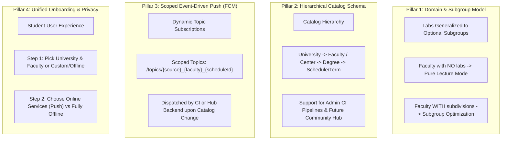
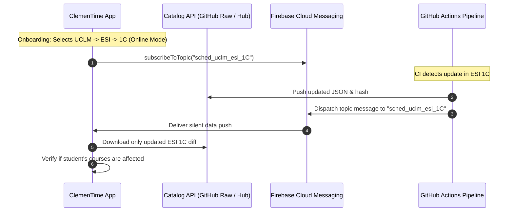

# Multi-Faculty Schedule Architecture & FCM Push Synchronization

## 1. Executive Summary & Problem Statement

ClemenTime was originally architected specifically around the **Escuela Superior de Informática (ESI) at UCLM**, hardcoding assumptions around:
1. **Catalog & Semester Structure**: Exactly two annual files (`1C` and `2C`), stored in `dist/1C.json` and `dist/2C.json`.
2. **Nomenclature & Domain Quirks**: ESI TV Hall API, `Pruebas de Progreso`, general conferences, and laboratory groups (`grupo_practicas`, `-L`, `-Lab`).
3. **Synchronization**: Hardcoded index endpoints and fixed WorkManager polling keys (`auto_update_interval_hours`).

To scale ClemenTime beyond ESI to other faculties, universities, or even a community-driven "Schedule Hub", while simultaneously transitioning to **Firebase Cloud Messaging (FCM)** push notifications, the architecture must generalize across four pillars:



---

## 2. Generalizing the Lab Selection System (Addressing the Lab Concern)

### 2.1. The User's Concern: "Not every faculty has labs"
A central worry when expanding to Law, Humanities, Business, or other engineering schools is that timetable structures differ:
- **Humanities / Law / Social Sciences**: Often have **no laboratories whatsoever**. Students have fixed lecture slots per group with no subdivision variants.
- **Sciences / Engineering**: Have lectures + laboratory groups (`L1`, `L2`, `L3`) or seminar groups (`S1`, `S2`).
- **Medical / Nursing**: Have clinical rotations, seminars, and lectures.

### 2.2. Reality Check in ClemenTime's Current Codebase
A close inspection of `ConflictSolver.kt`, `Subject.kt`, and `ClassSlot.kt` reveals that **ClemenTime already handles lab-free subjects natively**:

```kotlin
// In ConflictSolver.kt:
val subjectsWithChoices = subjects.filter { s ->
    !s.subject.isDummy && s.subject.selectedLabGroup == null && run {
        val labGroupCount = s.slots
            .filter { it.entryType == EntryType.LAB }
            .mapNotNull { it.labGroupName }
            .distinct()
            .size
        labGroupCount > 1 // Only subjects with >1 lab group are treated as choices!
    }
}
```

1. If a subject has **0 lab slots** (e.g. standard lecture-only classes):
   - `labGroupCount == 0`.
   - The subject is **never added** to `subjectsWithChoices`.
   - All its slots are routed directly into `fixedSlots`.
   - The Cartesian product combination has length 1.
   - The conflict solver simply checks for lecture clashes (e.g. cross-course enrollment conflicts).
2. In the UI (`ConflictResolverComponents.kt` and `SubjectItemComponents.kt`):
   - Lab selection chips and badges are **only rendered** when `ConflictSolver.labVariantCount(subject) > 1`.
   - If a subject has no labs, **no lab selection UI is shown**. The subject behaves like a regular class.

### 2.3. The Architectural Generalization: From "Lab" to "Subgroup / Activity Group"
To prevent semantic awkwardness when showing seminars or workshops, we generalize the vocabulary:
- **Wire Schema & Model**:
  - `entryType`: Rename or treat `LAB` as `SUBGROUP` (or retain `LAB` as a subtype of `SUBGROUP`).
  - `labGroupName`: Renamed/aliased to `subgroupName` (e.g. `"Seminario A"`, `"Prácticas 2"`, `"Taller 1"`).
  - `selectedLabGroup`: Renamed/aliased to `selectedSubgroup`.
- **UI Presentation**:
  - If a faculty's schedule has zero subgroups, ClemenTime seamlessly functions in **"Standard Fixed Schedule Mode"**.
  - The "Conflict Resolver / Optimizer" tab gracefully adapts:
    - If the student has enrolled in subjects with multiple subgroups $\to$ Shows the subgroup optimizer.
    - If all enrolled subjects are fixed $\to$ Shows an overlap report or congratulates the student that no conflicts exist.

---

## 3. Ingestion Strategy: Admin Pipelines vs. Community "Schedule Hub"

Scaling beyond ESI raises the question of how schedule data is collected, validated, and published. We evaluate three models:

```
┌────────────────────────────────────────────────────────────────────────┐
│                        Ingestion Strategy Comparison                   │
├───────────────────────┬──────────────────────┬─────────────────────────┤
│ Model A:              │ Model B:             │ Model C: Recommended    │
│ Multi-Pipeline (CI)   │ Pure Schedule Hub    │ Hybrid Progressive Hub  │
├───────────────────────┼──────────────────────┼─────────────────────────┤
│ • Scrapers per school │ • Crowdsourced wiki  │ • Core CI scrapers for  │
│ • Admin maintains all │ • Users upload JSON  │   partner faculties     │
│ • High quality        │ • High scalability   │ • Community Hub for     │
│ • High admin overhead │ • Moderation & spam  │   user-submitted files  │
│                       │   risks              │ • Unified JSON format   │
└───────────────────────┴──────────────────────┴─────────────────────────┘
```

### Model C (Hybrid Progressive Architecture) — Recommended:
1. **Standard Normalized Wire Format**:
   - All faculties — whether scraped by CI or uploaded by students — conform to a single standardized schema:
     ```json
     {
       "schema_version": 2,
       "faculty_id": "uclm_esi",
       "faculty_name": "Escuela Superior de Informática",
       "university": "Universidad de Castilla-La Mancha",
       "term_id": "2026_1C",
       "term_title": "1º Cuatrimestre (2026-2027)",
       "subgroups_label": "Laboratorios", 
       "slots": [
         {
           "codigo": "FunProg1",
           "asignatura": "Fundamentos de Programación 1",
           "grupo": "1A",
           "dia": 1,
           "hora_inicio": "08:30",
           "hora_fin": "10:00",
           "aula": "Fermín Caballero - A1.1",
           "profesor": "GARCIA",
           "tipo": "teoria",
           "subgrupo": null
         },
         {
           "codigo": "FunProg1",
           "asignatura": "Fundamentos de Programación 1",
           "grupo": "1A",
           "dia": 3,
           "hora_inicio": "10:00",
           "hora_fin": "11:30",
           "aula": "LD1",
           "profesor": "LOPEZ",
           "tipo": "subgrupo",
           "subgrupo": "Lab 1"
         }
       ]
     }
     ```
2. **Hierarchical Master Index (`schedules_catalog.json`)**:
   Instead of the flat `[{"id": "1C"}, {"id": "2C"}]`, the remote catalog becomes hierarchical:
   ```json
   {
     "version": 2,
     "universities": [
       {
         "id": "uclm",
         "name": "Universidad de Castilla-La Mancha",
         "faculties": [
           {
             "id": "esi",
             "name": "Escuela Superior de Informática (Ciudad Real)",
             "fcm_topic_prefix": "uclm_esi",
             "terms": [
               { "id": "1C", "name": "1º Cuatrimestre", "url": "schedules/uclm/esi/1C.json", "hash": "..." },
               { "id": "2C", "name": "2º Cuatrimestre", "url": "schedules/uclm/esi/2C.json", "hash": "..." }
             ]
           },
           {
             "id": "farmacia",
             "name": "Facultad de Farmacia (Albacete)",
             "fcm_topic_prefix": "uclm_farmacia",
             "terms": [
               { "id": "1C", "name": "1º Cuatrimestre", "url": "schedules/uclm/farmacia/1C.json", "hash": "..." }
             ]
           }
         ]
       }
     ]
   }
   ```
3. **Community Hub Extension (Phase 4)**:
   - When a community user creates a schedule (via an in-app export or a web-based builder), it generates the exact same standardized JSON.
   - Users can share schedules via **direct URL**, **QR code**, or submit to the **Schedule Hub** for admin review.

---

## 4. Reconciling the FCM Push Plan with Multi-Faculty

In our initial FCM study, we proposed static topics: `/topics/schedule_updates_1c` and `/topics/schedule_updates_2c`.

### 4.1. Why Static Topics Break in a Multi-Faculty World
If ClemenTime supports 10 faculties, having hardcoded topics would cause:
- **Cross-talk**: Students in Medicine would receive push wakeups when Computer Science schedules update.
- **Unnecessary battery drain**: Devices would download diffs for schedules they don't follow.

### 4.2. Scoped Dynamic Topic Subscriptions
With the hierarchical catalog, FCM topics are dynamically scoped:

$$\text{Topic Format: } \texttt{sched\_\{university\}\_\{faculty\}\_\{term\}}$$

*Example Topics:*
- `sched_uclm_esi_1C`
- `sched_uclm_esi_2C`
- `sched_uclm_farmacia_1C`

### 4.3. Dispatch Architecture (CI & Hub)
1. **Official Scraped Faculties (GitHub Actions)**:
   - When `.github/workflows/sync-esi-schedules.yml` (or future multi-faculty workflows) detects changes for ESI, it dispatches to `sched_uclm_esi_1C`.
   - Only students enrolled in ESI's 1st semester receive the push.
2. **Community / Custom Schedules**:
   - If a student imports a schedule from a custom URL or local JSON file (not part of the catalog), **FCM topic push is omitted**. The app relies on either manual check or lightweight fallback.



---

## 5. Unified Onboarding & Settings Flow

### 5.1. New Onboarding Flow (3 Simple Steps)

```
┌────────────────────────────────────────────────────────┐
│                   Welcome to ClemenTime                │
│                                                        │
│  Step 1: Choose Your University & Center              │
│  ┌──────────────────────────────────────────────────┐  │
│  │ Universidad de Castilla-La Mancha (UCLM)       ▼ │  │
│  └──────────────────────────────────────────────────┘  │
│  ┌──────────────────────────────────────────────────┐  │
│  │ Escuela Superior de Informática (Ciudad Real)   ▼ │  │
│  └──────────────────────────────────────────────────┘  │
│  [ Or enter a custom Schedule URL / Import JSON file ] │
│                                                        │
│  Step 2: Choose Synchronization Mode                  │
│  ● Online Services (Recommended)                       │
│    - Automatic timetable download                      │
│    - Instant FCM push alerts when your classes change  │
│    - Minimal battery usage                             │
│                                                        │
│  ○ Fully Offline (Privacy-First)                       │
│    - Zero external network connections                 │
│    - Manual timetable import via JSON file             │
│    - No background services or Google telemetry        │
│                                                        │
│                     [ Continue ]                       │
└────────────────────────────────────────────────────────┘
```

### 5.2. Settings Experience ("More" Screen)
- **Active Faculty & Term**: Displays `UCLM - ESI (1º Cuatrimestre)`.
  - Tapping allows switching faculties or semesters (automatically unsubscribing from old FCM topic and subscribing to the new one).
- **Sync Mode Toggle**:
  - `Online Sync (Push Notifications)` [ON / OFF]
  - "Check for updates now" action.
  - "Notify only for changes in my enrolled subjects".

---

## 6. Comprehensive Unified Roadmap

### Phase 1: Data Model Generalization (Zero Backend Required)
- **Refactor `ClassSlot` and `Subject`**:
  - Aliasing/documenting `entryType`: Treat `LAB` as a generalized `SUBGROUP`.
  - Ensure UI labels dynamically adapt: if `subgroups_label` in JSON is `"Seminarios"`, UI displays "Seminario"; if null/empty, hides subgroup chips entirely.
- **Verify Lab-Free Compatibility**:
  - Add comprehensive unit tests in `ConflictSolverTest` validating schedules with 0 labs, 1 lab, and mixed subjects.

### Phase 2: Hierarchical Catalog Specification
- Define `schedules_catalog.json` schema v2 supporting Universities $\to$ Faculties $\to$ Terms.
- Update `ImportRepository` to parse both legacy `schedules_index.json` (for backward compatibility) and hierarchical `schedules_catalog.json`.
- Add Faculty/Center picker in `OnboardingScreen` and `ImportScreen`.

### Phase 3: Dynamic FCM Push Dispatch & Client Integration
- Integrate Firebase Messaging into Android app (`ClemenTimeFirebaseMessagingService`).
- Connect topic subscription to active faculty/term (`sched_{uni}_{faculty}_{term}`).
- Set up Service Account & Python dispatch script in GitHub Actions (`.github/workflows/sync-esi-schedules.yml`).
- Add GMS availability check with graceful fallback to manual checking on de-Googled devices.

### Phase 4: Online Services vs. Fully Offline Toggle & Cleanup
- Implement the binary choice in `OnboardingScreen.kt`.
- Clean up legacy settings (`auto_update_interval_hours`, `migrateLegacyAutoUpdateDefault`).
- Implement one-time expedited WorkManager diff checker triggered by incoming FCM push.

### Phase 5: Multi-Faculty Expansion & Schedule Hub (Future)
- Add GitHub Actions scrapers for additional faculties/universities as demand grows.
- Explore Community Schedule Hub: web portal or GitHub PR bot allowing student associations to submit and maintain their own faculty schedule JSON files.

---

## 7. Conclusion

By recognizing that **ClemenTime already supports lab-free subjects seamlessly**, the fear of generalizing the app is resolved. By designing the **FCM topics to be dynamic and scoped** (`sched_{uni}_{faculty}_{term}`), both the push-notification architecture and the multi-faculty roadmap align into a clean, unified, and future-proof design without requiring expensive dedicated servers.
