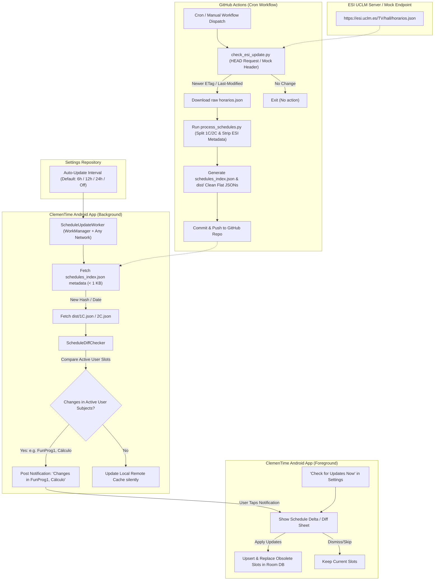

# Architecture & Implementation Plan: ESI Schedule Auto-Sync & Flat Schema Migration

> **Location**: Saved in repository at `docs/schedules_auto_update_plan.md` for team and subagent access.

---

## Executive Summary & Design Goals
This document specifies the step-by-step architecture to transition ClemenTime to consume a **flat JSON slot schema** (array of slot objects), automate schedule sync from ESI UCLM via GitHub Actions, and provide background schedule change detection in the Android app with non-intrusive notifications and an interactive **Schedule Diff Review Sheet**.

To allow incremental implementation and testing by autonomous agents or developers, the plan is broken down into **5 independent, testable phases**. Each phase includes explicit test hooks (including mock server/header flags) so every feature can be verified without waiting for live ESI server updates.

---

## 🏗️ End-to-End System Architecture



---

## 📋 Data Schema Cleaning & File Naming Strategy

### 1. Raw Input vs Processed ESI Pipeline Output
The ESI server provides raw layout/grid fields (`celda_dividida`, `posicion_en_celda`) that are purely for ESI web rendering and are **not** needed by ClemenTime. 

The ESI-specific Python pipeline (`process_schedules.py`) performs two main tasks:
1. **Semester Splitting**: Splits raw entries by `cuatrimestre` ("1C" vs "2C") into standard clean distribution files `schedules/dist/1C.json` and `schedules/dist/2C.json`.
2. **Metadata Stripping**: Strips out `celda_dividida` and `posicion_en_celda`.

#### Processed Flat Distribution Schema (`schedules/dist/1C.json`, `schedules/dist/2C.json`)
Cleaned flat JSON slot array:

```json
[
  {
    "grupo": "1A",
    "cuatrimestre": "1C",
    "dia": "Lunes",
    "hora_inicio": "8:30",
    "hora_fin": "10:00",
    "asignatura": "FunProg1",
    "tipo": "teoría",
    "aula": "John von Neumann - A1.1",
    "profesor": "Jesus.Serrano",
    "es_laboratorio": false,
    "grupo_practicas": ""
  },
  {
    "grupo": "1A",
    "cuatrimestre": "1C",
    "dia": "Lunes",
    "hora_inicio": "11:30",
    "hora_fin": "13:00",
    "asignatura": "Cálculo-L",
    "tipo": "laboratorio",
    "aula": "John von Neumann - A1.1",
    "profesor": "MariaL.Lopez Inocente.Sánchez",
    "es_laboratorio": true,
    "grupo_practicas": "Lab-A1/A2"
  }
]
```

### 2. Title & Schedule Naming Resolution (`schedules_index.json`)
Since flat JSON arrays `[ ... ]` do not contain a root `"title"` metadata field, schedule titles and metadata are provided directly by `schedules_index.json` (generated by `generate_index.py`):

```json
[
  {
    "id": "1C",
    "title": "Primer Cuatrimestre",
    "description": "Horario oficial ESI UCLM - 1º Cuatrimestre",
    "path": "1C.json",
    "hash": "557f9887c4c5b0476292ed59588fb10fd22515d9cc9c0803b24b23e425a75a49",
    "updatedTime": "2026-07-30"
  },
  {
    "id": "2C",
    "title": "Segundo Cuatrimestre",
    "description": "Horario oficial ESI UCLM - 2º Cuatrimestre",
    "path": "2C.json",
    "hash": "17dafcd7fc33b208820efb894725c7402e851aef39d063beff86b8ac7c5e5625",
    "updatedTime": "2026-07-30"
  }
]
```

In Kotlin (`JsonScheduleParser.kt`), when parsing a flat JSON array directly (e.g. from local file import), the parser infers the schedule title from the file name or slot `cuatrimestre` field (e.g., `1C` -> `"Primer Cuatrimestre"`, `2C` -> `"Segundo Cuatrimestre"`).

---

## 🚀 Incremental Phase Breakdown

---

### Phase 1: Flat JSON Schema Parser & Python Processing Pipeline

#### Objectives
1. Add Kotlin data models and parsing logic in `JsonScheduleParser.kt` to decode flat JSON arrays `List<JsonFlatSlot>`.
2. Implement auto-detection in `JsonScheduleParser.kt` to handle both flat array JSONs `[ { ... } ]` and legacy tree JSONs `{ "version": 1, ... }`.
3. Dynamically map `List<JsonFlatSlot>` into `ScheduleJsonSchema` in memory so existing UI (`ImportScreen.kt`) and conflict detection (`ConflictSolver.kt`) function without modifications.
4. Update `process_schedules.py`, `parse_schedule.py`, and `generate_index.py` to strip ESI layout fields (`celda_dividida`, `posicion_en_celda`), generate human-readable titles in `schedules_index.json`, and produce `1C.json` & `2C.json` in `schedules/dist/`.

#### File Changes

##### 1. [NEW] `app/src/main/java/com/marcoslorcar/clementime/data/importing/model/FlatScheduleSlot.kt`
```kotlin
package com.marcoslorcar.clementime.data.importing.model

import kotlinx.serialization.SerialName
import kotlinx.serialization.Serializable

@Serializable
data class JsonFlatSlot(
    val grupo: String = "",
    val cuatrimestre: String = "1C",
    val dia: String = "",
    @SerialName("hora_inicio") val horaInicio: String = "",
    @SerialName("hora_fin") val horaFin: String = "",
    val asignatura: String = "",
    val tipo: String = "teoría",
    val aula: String = "",
    val profesor: String = "",
    @SerialName("es_laboratorio") val esLaboratorio: Boolean = false,
    @SerialName("grupo_practicas") val grupoPracticas: String = ""
)
```

##### 2. [MODIFY] `app/src/main/java/com/marcoslorcar/clementime/data/importing/parser/JsonScheduleParser.kt`
- Add auto-detection logic in `parseJson`: if string starts with `[`, parse as `List<JsonFlatSlot>` and map to `ScheduleJsonSchema` with fallback title inferred from `cuatrimestre`.
- Map Spanish day names (`Lunes`, `Martes`, etc.) to `DayOfWeek` enums (`MONDAY`, `TUESDAY`, etc.).

##### 3. [MODIFY] `schedules/script/parse_schedule.py` & `schedules/script/generate_index.py`
- Accept flat raw array, apply `mappings.json` normalizations, strip `celda_dividida` and `posicion_en_celda`, split by `cuatrimestre` to `1C.json` & `2C.json`, and output index entries with human-readable titles.

#### Verification Steps (Phase 1)
- **Unit Test**: Run `JsonScheduleParserTest` verifying decoding of `schedules/input/schedules.json`.
- **Python Verification Command**:
  ```bash
  python3 process_schedules.py --strict
  ```
  Check that `schedules/dist/1C.json`, `schedules/dist/2C.json`, and `schedules/dist/schedules_index.json` exist with valid titles and flat JSON arrays.

---

### Phase 2: ESI Endpoint Checker & Local Mock Testing CLI

#### Objectives
1. Create `schedules/script/check_esi_update.py` to check ESI HTTP `HEAD` response headers (`Last-Modified` / `ETag`).
2. Add a `--force` and `--mock-url` CLI flag to allow testing updates against local mock files or custom test URLs without waiting for live ESI server updates.
3. Save endpoint state in `schedules/input/esi_meta.json`.

#### File Changes

##### 1. [NEW] `schedules/script/check_esi_update.py`
```python
#!/usr/bin/env python3
import sys
import os
import json
import urllib.request

DEFAULT_ESI_URL = "https://esi.uclm.es/TV/hall/horarios.json"
META_FILE = os.path.join(os.path.dirname(__file__), "..", "input", "esi_meta.json")
INPUT_JSON = os.path.join(os.path.dirname(__file__), "..", "input", "schedules.json")

def check_update(url=DEFAULT_ESI_URL, force=False):
    req = urllib.request.Request(url, method="HEAD")
    try:
        with urllib.request.urlopen(req) as resp:
            headers = dict(resp.headers)
            last_modified = headers.get("Last-Modified", "")
            etag = headers.get("ETag", "")
    except Exception as e:
        print(f"[Error] Failed to fetch HEAD from {url}: {e}")
        return False

    meta = {}
    if os.path.exists(META_FILE):
        with open(META_FILE, "r") as f:
            meta = json.load(f)

    if force or meta.get("last_modified") != last_modified or meta.get("etag") != etag:
        print(f"[Update Detected] Downloading {url}...")
        urllib.request.urlretrieve(url, INPUT_JSON)
        meta["last_modified"] = last_modified
        meta["etag"] = etag
        with open(META_FILE, "w") as f:
            json.dump(meta, f, indent=2)
        return True
    else:
        print("[No Update] ESI schedule headers unchanged.")
        return False
```

#### Verification Steps (Phase 2)
- **Local Test Command**:
  ```bash
  python3 schedules/script/check_esi_update.py --force
  ```
  Verify `schedules/input/esi_meta.json` is updated and returns exit code 0.

---

### Phase 3: GitHub Actions Automation (`sync-esi-schedules.yml`)

#### Objectives
1. Create GitHub Action running on a 6-hour schedule (`0 */6 * * *`) and on `workflow_dispatch` (manual button).
2. Automatically run `check_esi_update.py` and `process_schedules.py`.
3. Commit updated `schedules/dist/` and `schedules_index.json` to main.

#### File Changes

##### 1. [NEW] `.github/workflows/sync-esi-schedules.yml`

#### Verification Steps (Phase 3)
- Trigger manually via GitHub UI (`Actions` tab -> `Sync ESI Schedules` -> `Run workflow`).

---

### Phase 4: Android Settings, Diff Engine & WorkManager Worker

#### Objectives
1. Add settings in `SettingsRepository.kt` for `auto_update_interval_hours` (Default: 6, Options: 0=Off, 6, 12, 24).
2. Implement `ScheduleDiffChecker.kt` to compare Room DB active slots against remote flat JSON slots.
3. Implement `ScheduleUpdateWorker.kt` running on any network connection.
4. If changed subjects are detected (e.g. `FunProg1`, `Cálculo`), post notification naming affected subjects.
5. Add a **"Check for Schedule Updates Now"** button in `MoreScreen.kt`.

#### File Changes

##### 1. [NEW] `app/src/main/java/com/marcoslorcar/clementime/utils/ScheduleDiffChecker.kt`
##### 2. [NEW] `app/src/main/java/com/marcoslorcar/clementime/worker/ScheduleUpdateWorker.kt`
##### 3. [MODIFY] `app/src/main/java/com/marcoslorcar/clementime/ui/screens/settings/MoreScreen.kt` & `MoreViewModel.kt`

#### Verification Steps (Phase 4)
- **Manual Debug Verification**: Tap "Check for Schedule Updates Now" in Settings. Verify Toast/Notification feedback.
- **Unit Test**: Test `ScheduleDiffCheckerTest` with modified mock slots.

---

### Phase 5: Schedule Delta / Diff UI & Upsert Execution

#### Objectives
1. Create `ScheduleDiffBottomSheet.kt` Compose UI displaying exact subject slot diffs.
2. Provide **"Apply Updates to Database"** (upsert new slots) and **"Dismiss / Keep Current"** options.
3. Connect notification tap action to navigate directly to `ScheduleDiffBottomSheet`.

#### File Changes

##### 1. [NEW] `app/src/main/java/com/marcoslorcar/clementime/ui/screens/scheduleimport/ScheduleDiffBottomSheet.kt`
##### 2. [MODIFY] `app/src/main/java/com/marcoslorcar/clementime/ui/screens/scheduleimport/ImportViewModel.kt`

#### Verification Steps (Phase 5)
- Open App -> Trigger Mock Diff -> Verify Bottom Sheet displays subject changes -> Tap "Apply Updates" -> Verify Room DB reflects updated slots cleanly.

---

## Summary Checklist for Implementing Agents

- [ ] **Phase 1**: Add `FlatScheduleSlot.kt`, update `JsonScheduleParser.kt`, `parse_schedule.py` & `generate_index.py` (titles & semester splitting). Run tests.
- [ ] **Phase 2**: Add `check_esi_update.py` with CLI test flags. Test locally.
- [ ] **Phase 3**: Add `.github/workflows/sync-esi-schedules.yml`. Verify manually on GitHub.
- [ ] **Phase 4**: Add `ScheduleDiffChecker.kt`, `ScheduleUpdateWorker.kt`, settings in `MoreScreen.kt`. Run tests.
- [ ] **Phase 5**: Add `ScheduleDiffBottomSheet.kt` & DB upsert logic. Perform end-to-end verification.
